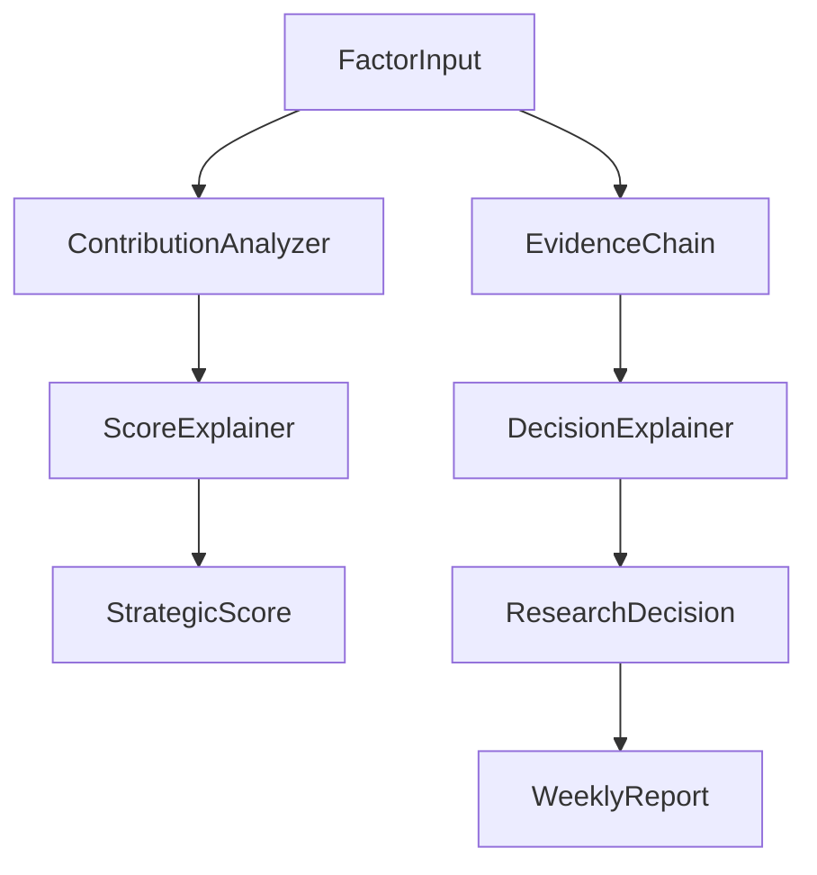

# Round 30 - Research Explainability

## 目标

为 `StrategicScore`、`ResearchDecision` 和 `WeeklyReport` 增加可解释能力，让研究结果可以回答：

- 为什么这个标的得高分
- 哪些因子贡献最大
- 哪些因子拖累评分
- 哪些数据源支撑结论
- 哪些风险导致降级
- 为什么最终给出 `BUY` / `WATCH` / `REVIEW` / `AVOID`

## 新增模块

### `src/explainability/explanation_contract.py`

定义解释层核心对象：

- `FactorContribution`
- `ScoreExplanation`
- `DecisionExplanation`

### `src/explainability/contribution_analyzer.py`

负责计算因子贡献：

- `contribution_score = factor_score * factor_weight * confidence_score`
- 生成按贡献排序的列表
- 为后续解释层提供标准输入

### `src/explainability/score_explainer.py`

负责生成战略评分解释：

- Top Positive Factors
- Top Negative Factors
- 默认展示前 5 项

### `src/explainability/decision_explainer.py`

负责生成研究决策解释：

- 结合 `StrategicScore`
- 结合 `ResearchDecision`
- 结合 `EvidenceChain`
- 输出决策原因、支撑因子、风险因子和摘要

## 数据流

## 接口设计

### `FactorContribution`

- `factor_name`
- `factor_score`
- `factor_weight`
- `confidence_score`
- `contribution_score`
- `contribution_pct`

### `ScoreExplanation`

- `symbol`
- `period`
- `total_score`
- `top_positive_factors`
- `top_negative_factors`
- `confidence_score`
- `summary`

### `DecisionExplanation`

- `symbol`
- `period`
- `final_decision`
- `decision_reasons`
- `supporting_factors`
- `risk_factors`
- `confidence_score`
- `summary`

## 保持兼容

这轮只通过 optional field 和 adapter 接入：

- `StrategicScoreResult.evidence_refs`
- `ResearchDecision.evidence_refs`
- `ResearchDecision.score_explanation`
- `ResearchDecision.decision_explanation`
- `WeeklyReport` 预留解释字段

不改变已有主流程入参。

## 测试结果

本轮新增测试全部通过：

- `tests/test_contribution_analyzer.py`
- `tests/test_score_explainer.py`
- `tests/test_decision_explainer.py`
- `tests/test_weekly_report_explainability.py`

全量验证结果：

- 总测试数：19
- 通过数：19
- 失败数：0

## 未来扩展方向

- 将解释结果输出到 `reports/weekly_report.md`
- 生成单标的研究解释页
- 支持主题级别解释摘要
- 结合外部公告和财报变动生成解释差异
