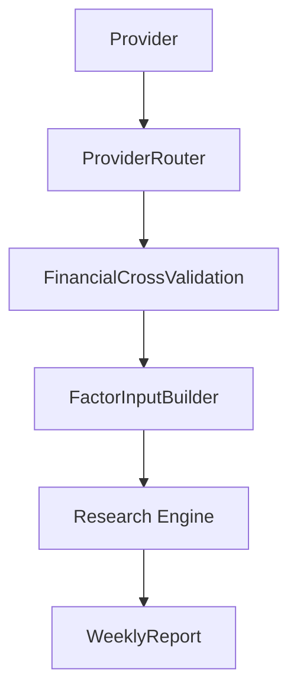

# Round 31 - Provider Trust Score Engine

## 目标

建立 Provider 评级体系，量化评估：

- 数据覆盖率
- 数据缺失率
- 历史稳定性
- 与其他 Provider 一致性
- 更新时间及时性
- 异常率

并将 `ProviderTrustScore` 接入：

- `ProviderRouter`
- `FinancialCrossValidation`
- `FactorInputBuilder`

## 新增模块

### `src/provider_trust/trust_contract.py`

定义 `ProviderTrustScore`：

- `provider_name`
- `overall_score`
- `coverage_score`
- `consistency_score`
- `freshness_score`
- `stability_score`
- `anomaly_score`
- `warning_count`
- `last_updated`

### `src/provider_trust/trust_calculator.py`

负责计算 Provider 信任评分。

核心模型：

```text
overall_score =
    0.25 * coverage_score
  + 0.30 * consistency_score
  + 0.20 * freshness_score
  + 0.15 * stability_score
  + 0.10 * anomaly_score
```

### `src/provider_trust/trust_registry.py`

维护 Provider -> TrustScore 的注册表。

### `src/provider_trust/trust_report.py`

输出 Provider Trust Ranking 报告文本。

## 数据流



## 接口设计

### `TrustCalculator`

- `calculate_coverage_score(total_fields, missing_fields)`
- `calculate_consistency_score(agreement_ratio)`
- `calculate_freshness_score(days_since_update)`
- `calculate_stability_score(success_count, total_count)`
- `calculate_anomaly_score(anomaly_count, total_count)`
- `calculate_provider_trust(...)`

### `TrustRegistry`

- `register_profile(profile)`
- `set_score(score)`
- `get_score(provider_name)`
- `list_scores()`
- `load_default_profiles()`

## 接入方式

### ProviderRouter

新增 `BEST_PROVIDER` 模式，优先使用 trust score 最高的 Provider。

### FinancialCrossValidation

交叉验证结果增加 `provider_trust_score`，用于标记验证依赖的数据源可靠性。

### FactorInput

最终 `confidence_score` 会乘以 `provider_trust_score`，形成更稳健的因子输入质量控制。

### WeeklyReport

新增：

- Provider Trust Ranking
- trust_warnings

## 测试结果

新增测试：

- `tests/test_trust_calculator.py`
- `tests/test_trust_registry.py`
- `tests/test_provider_router_trust.py`
- `tests/test_factor_input_provider_trust.py`

全量验证：

- 总测试数：27
- 通过数：27
- 失败数：0

## 未来扩展方向

- 引入 Provider 历史统计持久化
- 记录按字段的 trust score
- 基于时间窗口滚动更新 trust score
- 将 trust warnings 输出到专题报告和周报摘要
