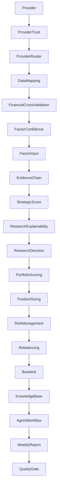

# V9 RC1 Architecture

## 1. 系统目标

将现有 V9 Strategic Research Platform 收敛到可交付的 RC1 版本，重点验证集成稳定性、架构边界和主流程可运行性。

## 2. 架构图

## 3. 数据流

Provider -> Trust -> Router -> Mapping -> Validation -> Confidence -> Factor Input -> Evidence -> Score -> Explainability -> Decision -> Portfolio -> Position -> Risk -> Rebalance -> Backtest -> Knowledge Base -> Workflow -> Weekly Report -> Quality Gate

## 4. 模块说明

- `src/quality` 负责 RC1 质量门禁
- `src/agent_workflow` 负责研究工作流编排
- `src/knowledge_base` 负责历史沉淀
- `src/backtest` 负责验证性回测
- `core/weekly_pipeline.py` 负责周报组装

## 5. 核心对象

- `QualityCheck`
- `QualityReport`
- `WorkflowStep`
- `WorkflowRun`
- `ResearchRecord`
- `BacktestResult`

## 6. 测试统计

- 以全量 pytest 作为 RC1 门禁
- 以周报生成结果作为集成验证
- 以质量门禁输出作为最终交付条件

## 7. 已知限制

- 回测仍使用研究样本与合成数据
- 质量门禁以结构与连通性检查为主
- 未接入真实行情与交易执行

## 8. V10 规划

- 更细粒度的质量分级
- 持久化知识库
- 更严格的依赖与边界审计
- 更强的回测对照与基准比较
