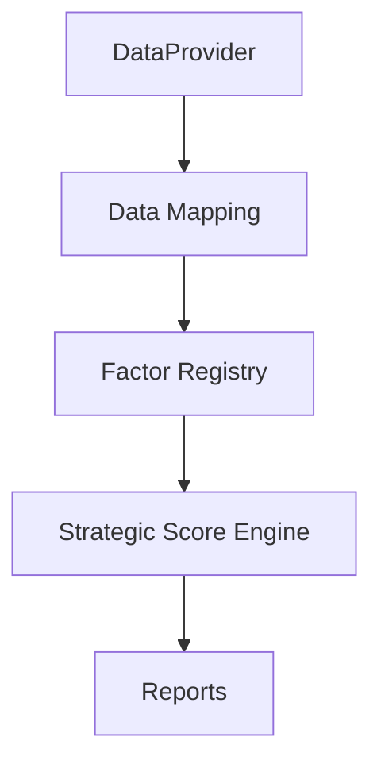

# Architecture V2

This document describes the consolidated V8 architecture after the
factor contract and registry refactor.

## 1. New Data Flow

## 2. Layer Responsibilities

### DataProvider

- Unified source interface
- Mock first
- Future adapters: AkShare / Tushare

### Data Mapping

- Normalize provider outputs
- Build factor-ready inputs
- Remove source-specific field leakage from downstream layers

### Factor Registry

- Hold canonical factor contracts
- Prevent duplicate factor definitions
- Keep factor names, versions, and score ranges explicit

### Strategic Score Engine

- Single strategic ranking entry point
- Consumes standardized factor inputs
- Produces strategic scores and explanations

### Reports

- Event analysis
- Watchlist reports
- Strategic ranking tables
- Audit and methodology notes

## 3. Why This Architecture

- Source data can change without forcing downstream rewrites
- Factor semantics are declared once in the registry
- Strategic scoring stays centralized
- Reports remain a thin presentation layer

## 4. Entry Point Rules

- `strategy/strategic_score_engine.py` is the only strategic scoring entry point
- `strategy/scoring_model.py` is legacy / sample scoring only
- Factor logic belongs in `factors/`
- Source normalization belongs in `core/data_mapping.py`

## 5. Design Goal

The design goal is to make research processing reproducible:

DataProvider
-> Data Mapping
-> Factor Registry
-> Strategic Score Engine
-> Reports

## 6. Future Extension

- More provider adapters
- More factor contracts
- Stronger anti-double-counting rules
- Automated consistency checks
