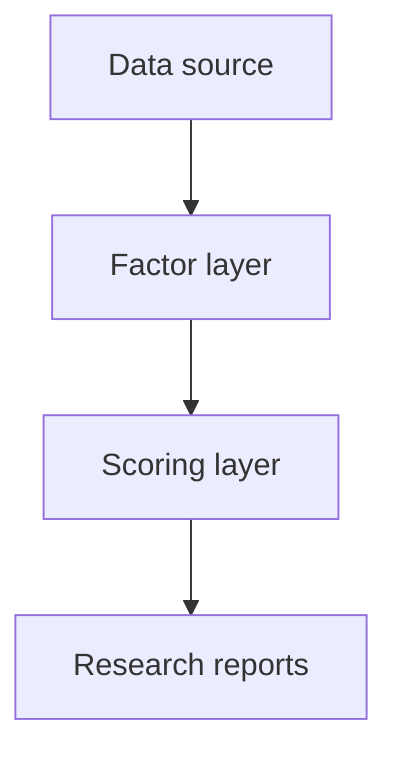

# Data Architecture

This document describes the data flow of the V8 research engine.

## 1. Data Flow

## 2. Layer Description

### Data source

The data layer provides company basic info, financial summaries, order
signals, news signals, and theme signals.

Current state:

- MockDataProvider is available now
- AkShare adapter is available as a parallel source layer
- Tushare adapter is available as a parallel source layer
- No external API integration is required for the research engine to run

### Factor layer

The factor layer transforms raw data into research-side signals, such as:

- `tau_factor_score`
- `order_confirmation_score`
- theme exposure
- strategic trend signals

### Scoring layer

The scoring layer consumes factor outputs and produces:

- `strategic_score`
- `factor_breakdown`
- `score_explanation`

### Research reports

The reporting layer converts scores and events into:

- weekly review reports
- monthly review reports
- event analysis notes
- strategic ranking tables

## 3. Provider Interface

All providers must inherit from `DataProvider` and implement:

- `get_company_basic_info()`
- `get_financial_summary()`
- `get_order_signals()`
- `get_news_signals()`
- `get_theme_signals()`

## 4. Adapter Layers

The source layer currently has three parallel provider options:

- `MockDataProvider` for deterministic local research runs
- `AkShareDataProvider` for future A-share market data integration
- `TushareDataProvider` for future financial and market data integration

All three providers implement the same `DataProvider` contract so
downstream factor and scoring modules stay source-agnostic.

## 5. AkShare Adapter

`data_sources/akshare_provider.py` is a thin adapter that may return
placeholder payloads when AkShare is not installed. It is designed to
stay source-side only and should not contain factor logic.

## 6. Tushare Adapter

`data_sources/tushare_provider.py` mirrors the AkShare adapter
structure. It is also a thin adapter only, and may return placeholder
payloads when Tushare is not installed.

## 7. Future Extension

Planned future adapters:

- more AkShare field mappings
- more Tushare field mappings
- file-based provider
- database-backed provider

The interface is intentionally stable so downstream factor and scoring
modules do not need to change when the data source changes.
