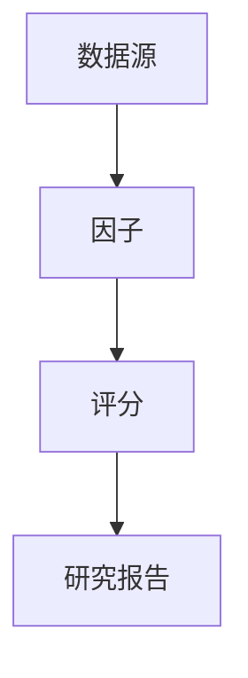

# Data Architecture

This document describes the future data flow of the V8 research engine.

## 1. Data Flow

## 2. Layer Description

### 数据源

The data layer provides company basic info, financial summaries, order
signals, news signals, and theme signals.

Current state:

- Mock Data only
- No external API integration
- Unified provider interface for future AkShare / Tushare adapters

### 因子

The factor layer transforms raw data into research-side signals, such as:

- τ 因子
- order_confirmation_score
- theme exposure
- strategic trend signals

### 评分

The scoring layer consumes factor outputs and produces:

- strategic_score
- factor_breakdown
- score_explanation

### 研究报告

The reporting layer converts scores and events into:

- weekly review reports
- monthly review reports
- event analysis notes
- strategic ranking tables

## 3. Provider Interface

All providers must inherit from `DataProvider` and implement:

- `get_company_basic_info()`
- `get_financial_summary()`
- `get_order_signals()`
- `get_news_signals()`
- `get_theme_signals()`

## 4. Future Extension

Planned future adapters:

- AkShare provider
- Tushare provider
- file-based provider
- database-backed provider

The interface is intentionally stable so downstream factor and scoring
modules do not need to change when the data source changes.
