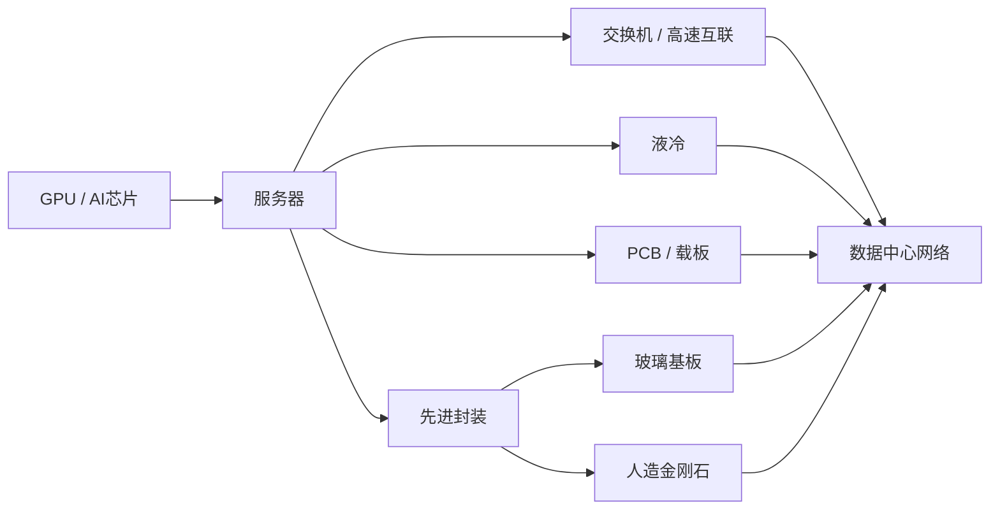
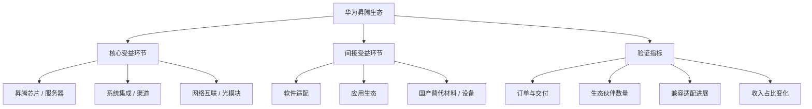

# V8 产业链图谱

本文档用于梳理 V7/V8 研究引擎的核心产业链关系，帮助统一主题观察口径。

## 1. AI算力产业链

### 产业节点说明

- `GPU / AI芯片`
  - 负责算力供给
  - 决定训练与推理集群的算力上限

- `服务器`
  - 承接算力芯片，形成可部署的计算节点
  - 连接上游芯片与下游数据中心需求

- `交换机 / 高速互联`
  - 负责集群内部互联与带宽扩展
  - AI集群扩容时通常同步受益

- `液冷`
  - 对应高功率密度机柜的散热需求
  - 随机柜功率上升而重要性提升

- `PCB / 载板`
  - 提供高速信号承载与封装连接基础
  - 与服务器、交换机、先进封装共同演进

- `先进封装`
  - 连接芯片与系统的关键工艺
  - 决定性能、功耗、集成度和扩展性

- `玻璃基板`
  - 可作为先进封装相关材料路线观察方向
  - 适合跟踪试产、良率与客户验证

- `人造金刚石`
  - 可关联热管理、超硬材料和高端制造材料链
  - 主要用于产业升级和材料路线观察

## 2. 华为昇腾生态图谱

### 核心受益环节

- 昇腾芯片与服务器
  - 直接承接算力部署需求
  - 观察订单、交付和生态扩张

- 系统集成与渠道
  - 承接行业项目落地
  - 关注方案销售、项目验收和客户扩张

- 网络互联与光模块
  - 负责超节点与集群内部通信
  - 关注带宽、时延和集群扩容需求

### 间接受益环节

- 软件适配
  - 围绕昇腾平台的操作系统、应用软件和行业软件适配

- 应用生态
  - 围绕大模型、行业解决方案、终端协同展开

- 国产替代材料 / 设备
  - 半导体设备、材料和制造链条中的国产替代方向

### 验证指标

- 订单与交付
  - 是否出现新增订单
  - 是否出现项目交付节点
  - 收入确认是否同步

- 生态伙伴数量
  - 是否有新增合作伙伴
  - 生态伙伴是否持续扩张

- 兼容适配进展
  - 软件是否完成适配
  - 是否进入规模化部署

- 收入占比变化
  - 昇腾相关业务收入占比是否提升
  - 生态相关业务是否从概念转为业绩贡献

## 3. 研究使用方式

- 作为主题 watchlist 的上层结构参考
- 作为周报和月度复盘的产业链框架
- 作为核心观察池归类依据

## 4. 备注

- 本文档仅用于研究与观察
- 不构成投资建议
- 后续可根据新数据更新产业链层级和验证指标
