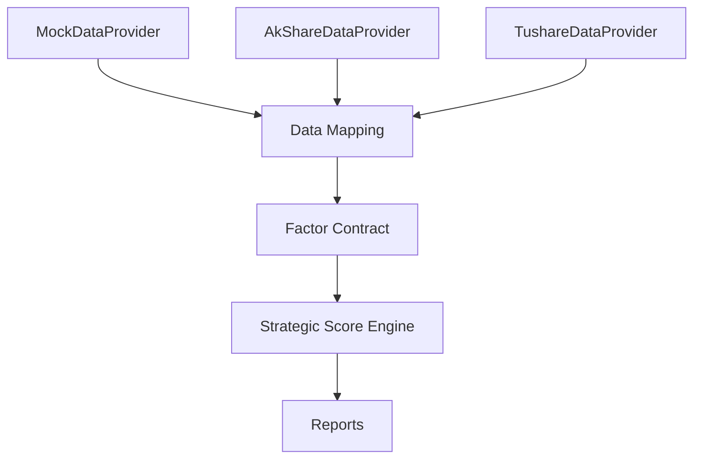

# Provider Comparison

This document compares the three data providers currently supported by
the V8 research engine architecture:

- `MockDataProvider`
- `AkShareDataProvider`
- `TushareDataProvider`

## 1. Comparison Table

| Provider | Data Coverage | Update Frequency | Best Use Case | Limitations | Future Plan |
| --- | --- | --- | --- | --- | --- |
| MockDataProvider | Deterministic placeholder data for all supported fields | Static | Local development, unit tests, architecture validation, offline demos | Not real market data; not suitable for investment research decisions | Keep as default fallback and regression test source |
| AkShareDataProvider | Future-ready adapter for market data, public signals, news, and theme-related inputs | Depends on upstream AkShare endpoints and local refresh schedule | Public A-share data access, event signals, source-side integration tests | Requires optional dependency; field mapping may vary by endpoint; no scoring logic inside provider | Expand endpoint mappings and enrich source normalization |
| TushareDataProvider | Future-ready adapter for standardized financial and market data | Depends on token, API quota, and refresh schedule | Financial summaries, structured fundamentals, cross-checking company-level data | Requires optional dependency; may require token; provider output must stay source-only | Expand token-backed financial coverage and improve standardization |

## 2. Provider Characteristics

### MockDataProvider

- Stable and deterministic
- No external dependency
- Safe default for the research engine
- Useful for testing the entire chain from data mapping to scoring

### AkShareDataProvider

- Adapter-only source layer
- Good for public A-share data and market-facing signals
- Should remain decoupled from factor logic
- Must degrade gracefully when AkShare is unavailable

### TushareDataProvider

- Adapter-only source layer
- Better suited for structured financial and fundamental data
- Should remain decoupled from factor logic
- Must degrade gracefully when Tushare is unavailable

## 3. Recommended Usage

### Local Development

Use `MockDataProvider` as the default input source.

Reason:

- deterministic output
- no network dependency
- easy to validate factor contracts and scoring logic

### Research Expansion

Use `AkShareDataProvider` and `TushareDataProvider` as parallel source
adapters when real data integration is needed.

Reason:

- AkShare can cover public market and event-style data
- Tushare can cover standardized financial data
- the two providers can cross-validate each other

### Production-Ready Research Workflow

Use a source fallback chain:

1. Tushare for standardized financial and fundamental data
2. AkShare for public market and event supplements
3. MockDataProvider as fallback when either source is unavailable

## 4. Recommended Data Flow Architecture

## 5. Architecture Notes

- Providers should only return raw or lightly structured data
- Field standardization belongs in `core/data_mapping.py`
- Factor semantics belong in `core/factor_contract.py`
- Strategic ranking belongs only in `strategy/strategic_score_engine.py`
- Reports should consume scores and explanations, not source APIs

## 6. Future Planning

Recommended next steps:

1. Add explicit source priority configuration in `config/`
2. Add adapter-level field validation
3. Add a source health check script
4. Add contract tests to confirm provider outputs stay compatible
5. Add more provider implementations only when a clear data need exists

